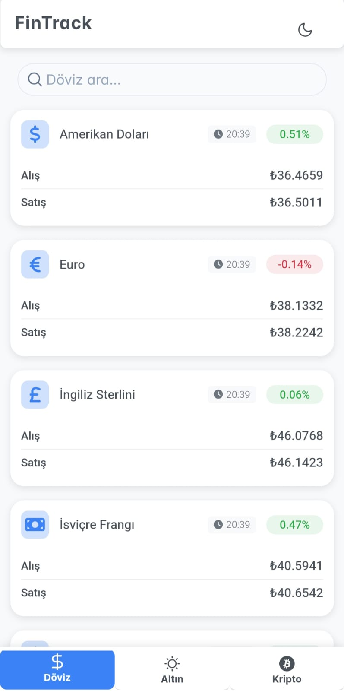
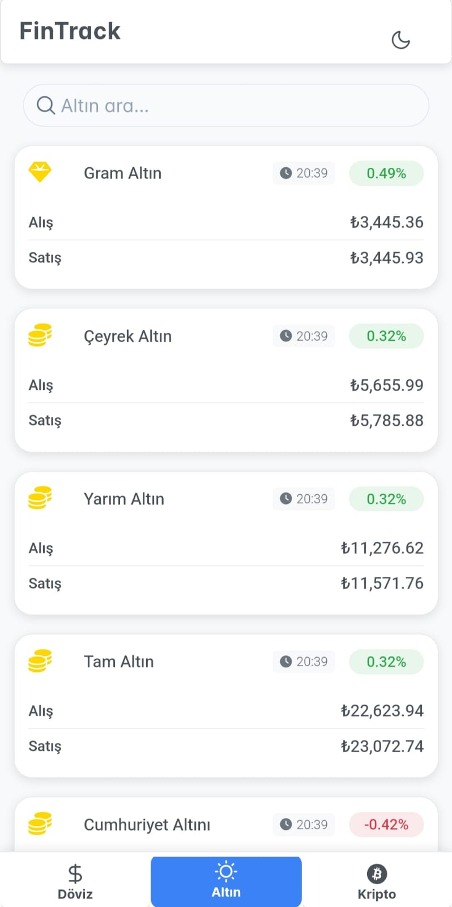
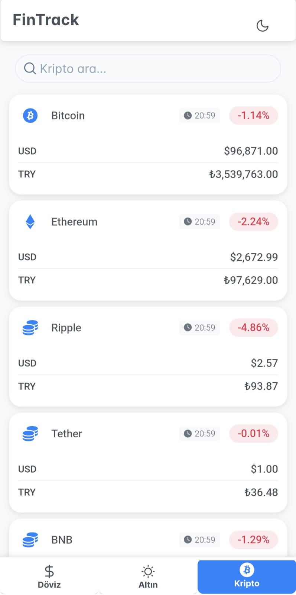

# FinansTakip

Bu proje, [Truncgil Finans API](https://finans.truncgil.com/) kullanılarak VS Code Copilot Agent ile oluşturulmuş bir altın, döviz ve kripto para fiyatlarını takip eden uygulamadır.

## Kullanım

1. Depoyu klonlayın:
   ```sh
   git clone <repo-url>
   cd finans-takip
   ```
2. Bağımlılıkları yükleyin:
   ```sh
   npm install
   ```
3. Geliştirme sunucusunu çalıştırın:
   ```sh
   ng serve
   ```
   Uygulamayı tarayıcıda açmak için: [http://localhost:4200](http://localhost:4200)

## API

Bu proje, anlık altın, döviz ve kripto para fiyatlarını almak için [Truncgil Finans API](https://finans.truncgil.com/) kullanmaktadır.

## Özellikler
- Anlık altın fiyatlarını görüntüleyin
- Döviz kurlarını takip edin
- Kripto para fiyatlarını izleyin
- Kullanıcı dostu ve mobil uyumlu arayüz

## Görseller

Projeden bazı ekran görüntüleri:

<div style="display: flex; gap: 10px;">
  
  
 
</div>